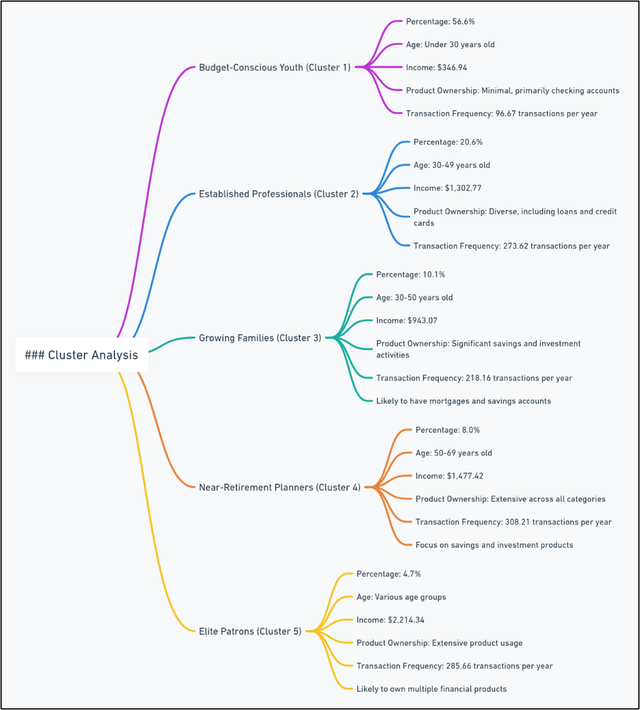

# Banking Customer Analytics

### Customer Segmentation, Activity Modelling & Churn Analytics

## Overview

Understanding customers is at the heart of an effective banking strategy.

This project explores two related business questions within a retail banking environment:

1. How can customers be segmented into meaningful groups for targeted marketing and product strategies?
2. Which factors influence customer engagement and churn, and how can retention be improved?

Using a combination of clustering techniques, statistical testing, and predictive modelling, this project develops a customer analytics framework that moves from understanding customer segments to identifying retention opportunities.

---

## Business Objectives

The bank sought to:

* Identify distinct customer groups based on demographic, financial, and behavioural characteristics.
* Develop targeted strategies for each customer segment.
* Understand the drivers of customer activity levels.
* Predict the probability of customer churn.
* Improve customer retention and increase customer lifetime value.

---

## Project Structure

The analysis was conducted in two stages:

### Stage 1: Customer Segmentation

Identify naturally occurring customer groups and develop segment-specific business strategies.

### Stage 2: Activity & Churn Analytics

Model customer engagement and churn behaviour to identify retention opportunities and estimate business impact.

Together, these analyses provide a customer-centric view of acquisition, engagement, and retention.

---

## Customer Segmentation Analysis

### Objective

The objective of the segmentation analysis was to identify distinct customer groups with similar demographic, financial, and behavioural characteristics.

### Methodology

Customer segmentation was performed using **Two-Step Cluster Analysis**, a machine learning technique well suited to large datasets containing both continuous and categorical variables.

Additional statistical techniques were used to validate and profile the resulting segments:

* Two-Step Cluster Analysis
* Silhouette Measure of Cohesion and Separation
* ANOVA
* Games-Howell Post Hoc Testing
* Chi-Square Testing
* Correlation Analysis

The analysis identified **five distinct customer segments**, each exhibiting unique behavioural and financial characteristics.

### Customer Segments

#### Budget-Conscious Youth

Young customers with low income, limited product ownership, and relatively low transaction activity.

#### Established Professionals

Middle-aged customers with moderate income levels and diversified product ownership, including loans and credit cards.

#### Growing Families

Customers with higher income levels, active savings behaviour, and strong engagement with banking products.

#### Near-Retirement Planners

High-income customers approaching retirement who demonstrate extensive product ownership and high transaction activity.

#### Elite Patrons

High-value customers with extensive banking relationships, premium product usage, and strong engagement levels.

### Business Value

The segmentation framework enables:

* Targeted marketing campaigns
* Product personalization
* Improved cross-selling opportunities
* Better allocation of marketing resources
* More effective customer acquisition and retention strategies
---

## Customer Activity Analytics

### Business Question

What factors influence customer engagement and transaction activity?

### Methodology

A **Linear Regression** model was developed to identify the key drivers of customer activity levels.

Variables evaluated included:

* Loan Ownership
* Credit Card Ownership
* Checking Accounts
* Savings Accounts
* Investment Accounts
* Income
* Age

The dependent variable was:
* Number of Transactions (Activity Level)

### Key Findings

The analysis found that:

* Product ownership generally increases activity levels.
* Customers with checking and savings accounts demonstrate higher engagement.
* Higher-income customers tend to be more active.
* Customer activity tends to decline with age.

These findings provide valuable insights into customer engagement behaviour and help identify opportunities to increase customer interaction with banking services.

---

## Customer Churn Analytics

### Business Question

Which customers are most likely to leave the bank?

### Methodology

A **Logistic Regression** model was developed to estimate the probability of customer churn.

Variables included:

* Loans
* Credit Cards
* Mortgages
* Savings Accounts
* Investment Accounts
* Number of Transactions
* Age

### Key Findings

The analysis showed that customers who owned multiple banking products were generally less likely to churn.

In particular:

* Mortgage ownership reduced churn risk.
* Savings products improved retention.
* Higher transaction activity was associated with lower churn probability.
* Customers using multiple products exhibited stronger loyalty.

The model was subsequently used to identify target groups for retention-focused marketing campaigns.

---

## Strategic Recommendations

Based on the combined findings from segmentation and churn analysis, several strategic opportunities were identified:

### Segment-Based Personalization

Develop tailored products and communication strategies for each customer segment.

### Product Bundling

Encourage the adoption of complementary products, such as mortgages, savings accounts, and credit cards, to strengthen customer relationships.

### Relationship Marketing

Implement personalized communication and loyalty programs to strengthen customer loyalty.

### Customer Lifecycle Management

Use customer segmentation and churn predictions together to proactively target customers at risk of leaving.

---

## Tools & Techniques

| Area                     | Techniques                                          |
| ------------------------ | --------------------------------------------------- |
| Customer Segmentation    | Two-Step Cluster Analysis                           |
| Statistical Validation   | ANOVA, Games-Howell, Chi-Square Testing             |
| Exploratory Analysis     | Correlation Analysis                                |
| Predictive Analytics     | Linear Regression                                   |
| Classification Modelling | Logistic Regression                                 |
| Data Preparation         | Outlier Treatment & Variable Selection              |
| Business Strategy        | Customer Profiling & Retention Strategy Development |
| Software                 | IBM SPSS Statistics                                 |

---

## Key Skills Demonstrated

* Customer Analytics
* Market Segmentation
* Statistical Analysis
* Predictive Modelling
* Machine Learning Applications
* Churn Prediction
* Business Strategy Development
* Data-Driven Decision Making
* Insight Communication

---

## Supporting Documentation

For readers interested in the detailed methodology and statistical outputs:

* **Customer Segmentation Report** – detailed cluster analysis, statistical testing, customer profiling, and segment-specific recommendations.
* **Customer Activity & Churn Analytics Presentation** – predictive modelling, churn probability analysis, and retention strategy recommendations.

These documents are included in this repository.

---

## ❗️Disclaimer

This project was developed as part of academic coursework and is shared here for educational and portfolio purposes. Unauthorised use, reproduction, or distribution is not permitted and may violate academic integrity policies.

